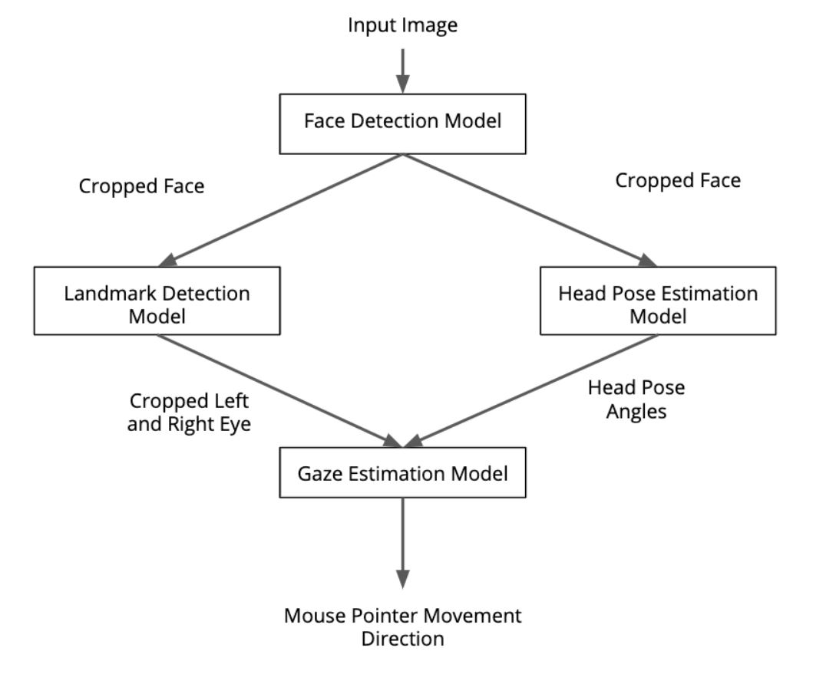

# Computer Pointer Controller

Control the mouse pointer of the computer by using gaze detection points. The gaze is the deep learning model to estimate the gaze of the user’s eyes and change the mouse pointer position accordingly. The gaze detection model depends on the output of the other models face-detection, head-pose-estimation, facial-landmarks. So, The application is an integration of face detection model, head-pose estimation model, and facial landmarks model.


## Project Set Up and Installation
Step1. Download [OpenVino Toolkit 2020.1](https://docs.openvinotoolkit.org/latest/index.html) with all the prerequisites by following this installation [guide](https://docs.openvinotoolkit.org/2020.1/_docs_install_guides_installing_openvino_windows.html)

Step2: Create Virtual Environment using command ```virtualenv venv``` in the command prompt

Step3. install all the dependency using ```pip install requirements.txt```.

Step4. Initialze the OpenVino Environment on your local setup. Given below are the commands to initialize:
```
cd C:\Program Files (x86)\IntelSWTools\openvino\bin\
setupvars.bat
```

Step5. Download the models using the commands below:
	
1. Face Detection Model
	```
	python /opt/intel/openvino/deployment_tools/tools/model_downloader/downloader.py --name "face-detection-adas-binary-0001"
	```
1. Gaze Estimation Model
	```
	python /opt/intel/openvino/deployment_tools/tools/model_downloader/downloader.py --name "gaze-estimation-adas-0002"
	```
1. Facial Landmarks Detection Model
	```
	python /opt/intel/openvino/deployment_tools/tools/model_downloader/downloader.py --name "landmarks-regression-retail-0009"
	```
1. Head Pose Estimation Model
	```
	python /opt/intel/openvino/deployment_tools/tools/model_downloader/downloader.py --name "head-pose-estimation-adas-0001"
	```

## Demo
Use the following command to run the app
```
python src/main.py -mf models/intel/face-detection-adas-binary-0001/FP32-INT1/face-detection-adas-binary-0001.xml -ml models/intel/landmarks-regression-retail-0009/FP32/landmarks-regression-retail-0009.xml -mh models/intel/head-pose-estimation-adas-0001/FP32/head-pose-estimation-adas-0001.xml -mg models/intel/gaze-estimation-adas-0002/FP32/gaze-estimation-adas-0002.xml -i bin/demo.mp4 -f ff fl fh fg
```
Output 


## Documentation

### Command Line Argument Information
* mf : Specify path of xml file of face detection model
* ml : Specify path of xml file of landmark regression model
* mh : Specify path of xml file of Head Pose Estimation model
* mg : Specify path of xml file of Gaze Estimation model
* i : Specify path of input Video file or cam for Webcam
* f (Optional): if you want to see preview video in separate window you need to Specify flag from ff, fl, fh, fg 
* pt (Optional): if you want to specify confidence threshold for face detection, default=0.6
* d (Optional): Specify Device for inference, the device can be CPU, GPU, FPGU, MYRID, default=CPU
* o : Specify path of output folder where we will store results
* b : Select True for benchmarking mode

### Project Structure
* models: This folder contains models in IR format downloaded from Openvino Model Zoo
* src: This folder contains model files, pipeline file(main.py) and utilities
	* face_detection_model.py
	* gaze_estimation_model.py
	* landmark_detection_model.py
	* head_pose_estimation_model.py
	* main.py file used to run complete pipeline of project. It calls has object of all the other class files in the folder
	* mouse_controller.py is utility to move mouse curser based on mouse coordinates received from gaze_estimation_model class predict method.	
	* input_feeder.py is utility to load local video or webcam feed
* bin: this folder has demo.mp4 file which can be used to test model 

## Benchmarks
*TODO:* Include the benchmark results of running your model on multiple hardwares and multiple model precisions. Your benchmarks can include: model loading time, input/output processing time, model inference time etc.

## Results
*TODO:* Discuss the benchmark results and explain why you are getting the results you are getting. For instance, explain why there is difference in inference time for FP32, FP16 and INT8 models.

## Stand Out Suggestions
This is where you can provide information about the stand out suggestions that you have attempted.

### Async Inference
If you have used Async Inference in your code, benchmark the results and explain its effects on power and performance of your project.

### Edge Cases
There will be certain situations that will break your inference flow. For instance, lighting changes or multiple people in the frame. Explain some of the edge cases you encountered in your project and how you solved them to make your project more robust.
